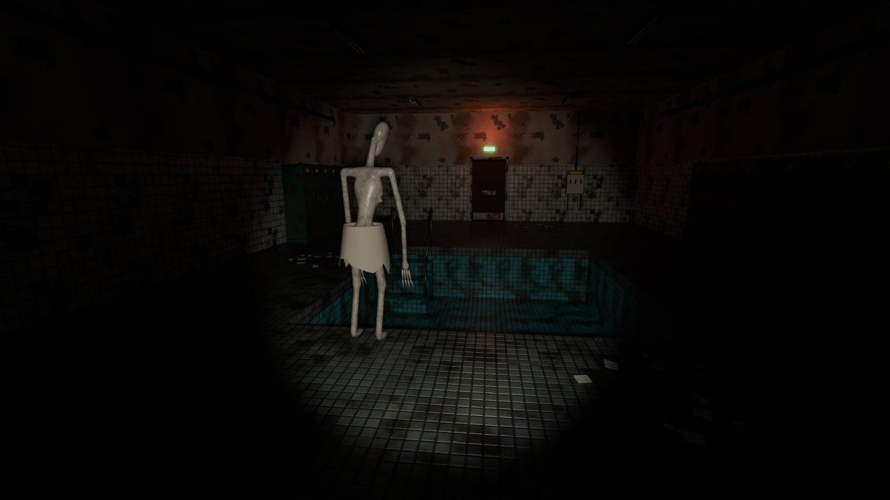

# El Vestuario — prototipo

Primer prototipo del juego: **una sala, un puzle y un enemigo que quiere matarte**, con integración de Twitch.
Motor: **Unreal Engine 5 (C++)**.



## La partida en 30 segundos

- Estás en el vestuario de un balneario abandonado. La puerta de salida tiene un cierre eléctrico y no hay corriente.
- Hay que encontrar **3 fusibles** (rojo, azul y verde) y colocarlos en el **cuadro eléctrico** en el orden correcto.
- La **nota de la pared** da la pista: *"El ROJO nunca va primero. El VERDE siempre sigue al ROJO."* → solución: **AZUL, ROJO, VERDE**.
- **El Bañista** es ciego pero **caza por el sonido**:
  - andar hace poco ruido y correr, mucho; agachado casi no haces ruido
  - si pones un fusible en la ranura equivocada, salta un **chispazo** que se oye en toda la sala
  - puedes **esconderte en las taquillas**, pero si te está persiguiendo y te oye entrar, abre la puerta
- Al volver la luz, la puerta se abre… y él viene a por ti. Corre al pasillo.

**Twitch:**
- `!ruido`: suena un golpe cerca de ti y el enemigo va hacia allí.
- `!pista`: la nota y los fusibles brillan unos segundos.

## Qué incluye este repositorio

| Carpeta | Contenido |
|---|---|
| `Source/ElVestuario/` | Todo el código C++ (jugador, IA, puzle, Twitch, HUD) |
| `SourceArt/Meshes/` | 21 modelos 3D en FBX (sala, taquillas, cuadro, fusibles, enemigo…) con colisiones |
| `SourceArt/Textures/` | 20 texturas procedurales (color + normal) de 1024 px |
| `SourceArt/Audio/` | 16 sonidos WAV (pasos, respiración, grito, chispazo, ambiente…) |
| `Tools/Art/` | Scripts que **generan** el arte y el audio (Blender + Python) |
| `Tools/Unreal/build_level.py` | Script que **monta el nivel** dentro de Unreal automáticamente |
| `Tools/layout.json` | Posición de cada objeto de la sala (lo usan Blender y Unreal) |
| `Docs/` | Imágenes de previsualización |

## Requisitos

- **Windows 10/11** y una GPU compatible con DX12. Una RTX 2070 o superior es lo recomendable para Lumen.
- **Unreal Engine 5.5 o 5.6**, instalado desde el Epic Games Launcher.
- **Visual Studio 2022** (Community es gratis) con estas cargas de trabajo:
  - "Desarrollo para el escritorio con C++"
  - "Desarrollo de juegos con C++", marcando dentro el componente *Unreal Engine installer*
  - el **SDK de Windows 10/11** más reciente

> Si tu versión de Unreal no es la 5.6: haz clic derecho en `ElVestuario.uproject` → **Switch Unreal Engine version…** y elige la tuya.

## Puesta en marcha (solo la primera vez)

1. **Genera los archivos de Visual Studio:** clic derecho en `ElVestuario.uproject` → **Generate Visual Studio project files**.
2. **Compila:** abre `ElVestuario.sln`, elige la configuración **Development Editor** y la plataforma **Win64**, y pulsa **Compilar → Compilar solución** (Ctrl+Mayús+B).
   También vale hacer doble clic en el `.uproject` y responder **Sí** cuando pregunte si quieres compilar los módulos.
3. **Abre el editor:** doble clic en `ElVestuario.uproject`. La primera vez tarda un rato compilando shaders.
4. **Monta el nivel:** menú **Tools → Execute Python Script…** → elige `Tools/Unreal/build_level.py`.
   - Importa modelos, texturas y sonidos, crea los materiales y construye el nivel `L_Vestuario`.
   - Tarda 1-3 minutos. Al acabar verás en el Output Log: `[Vestuario] TODO LISTO`.
5. **Juega:** pulsa **Play** (Alt+P).

A partir de ahí, el editor abre directamente `L_Vestuario`.

## Controles

| Tecla | Acción |
|---|---|
| WASD | Moverse |
| Ratón | Mirar |
| Shift | Correr (¡hace mucho ruido!) |
| Ctrl / C | Agacharse (casi silencioso) |
| E / clic izquierdo | Usar: coger, colocar, esconderse, leer |
| Q / rueda del ratón | Cambiar el fusible seleccionado |
| F | Linterna |
| Esc | Salir |
| **1** | Simular `!ruido` del chat |
| **2** | Simular `!pista` del chat |
| **3** | Mostrar el estado de la IA (Patrulla / Investiga / PERSIGUE) |

## Conectar Twitch

No hace falta cuenta de desarrollador ni claves: el juego lee el chat en **modo anónimo** (solo lectura). Hay tres formas:

- **Project Settings → Game → Twitch (El Vestuario) → Channel**: escribe el canal, sin `#`.
- **Al arrancar el juego** empaquetado: `ElVestuario.exe -twitch=nombredelcanal`
- **En la consola del juego** (tecla `º` o `~`): `TwitchConectar nombredelcanal`

Arriba a la derecha verás `Twitch: #canal` cuando esté conectado.

**Ajustes** (en Project Settings o en `Config/DefaultGame.ini`):

| Ajuste | Por defecto | Qué hace |
|---|---|---|
| `NoiseCooldown` | 60 s | Tiempo mínimo entre dos `!ruido` de todo el chat |
| `HintCooldown` | 90 s | Tiempo mínimo entre dos `!pista` |
| `PerUserCooldown` | 20 s | Tiempo que espera cada espectador entre comandos |
| `bShowUserNames` | false | Mostrar quién lanzó el comando. Desactivado para evitar nombres ofensivos en pantalla |

- También funcionan los alias en inglés `!noise` y `!hint`.
- Los cooldowns no se reinician al morir.

## Cómo ajustar la dificultad

Todo está en variables editables. Es más cómodo crear un Blueprint hijo de la clase y cambiar los valores en el panel *Details*.

| Clase | Variable | Efecto |
|---|---|---|
| `VestuarioCharacter` | `WalkLoudness` / `SprintLoudness` / `CrouchLoudness` | Cuánto ruido haces (× 30 m de oído del enemigo) |
| `VestuarioCharacter` | `MouseSensitivity`, `bInvertMouseY` | Ratón |
| `EnemyCharacter` | `PatrolSpeed` / `InvestigateSpeed` / `ChaseSpeed` | Velocidades del enemigo. Tú corres a 400 |
| `EnemyAIController` | `HearingRange`, `KillRadius`, `CloseNoiseDistance`… | Lo fino que tiene el oído y cuándo persigue |
| `FusePanel` | `CorrectOrder`, `SparkLoudness` | Solución del puzle y ruido del chispazo |

## Cambiar el arte por uno realista

Los modelos y sonidos actuales son **provisionales**: se generan por código para poder jugar ya.
Para mejorarlos, **sustituye el asset manteniendo el mismo nombre** y el código lo usará solo:

- **Modelos:** reimporta encima de `/Game/Vestuario/Meshes/SM_…`, o cambia el mesh en el actor.
  - Buenas fuentes: kits de baños o piscinas en Fab/Megascans, o modelos propios hechos en Blender.
  - Respeta la escala (1 unidad = 1 cm), que el frente mire a +X y el pivote de cada objeto.
- **Enemigo:** ahora es un mesh estático con animación procedural. El siguiente paso es un Skeletal Mesh (MetaHuman o modelo propio) con animaciones reales (Mixamo, mocap).
- **Sonidos:** reemplaza los `S_…` de `/Game/Vestuario/Audio/`. Hay librerías CC0 en Freesound y el pack gratuito de Sonniss GDC.

Para regenerar el arte provisional, por ejemplo después de cambiar `layout.json`:

```bash
cd Tools/Art
python gen_textures.py          # necesita numpy
python gen_audio.py             # necesita numpy
blender --background --python gen_meshes.py -- --preview   # o: pip install bpy && python gen_meshes.py --preview
```

Después vuelve a ejecutar `build_level.py` en Unreal.

## Problemas frecuentes

- **"Missing modules / Could not be compiled"**: falta Visual Studio con las cargas de C++, o la versión de Unreal no coincide. Revisa los requisitos y compila desde el `.sln` para ver el error exacto.
- **El script de Python no aparece o falla**: comprueba en **Edit → Plugins** que *Python Editor Script Plugin* y *Editor Scripting Utilities* están activos, y reinicia el editor.
- **El enemigo no se mueve**:
  - pulsa `P` en el editor para ver el navmesh (zona verde)
  - si no hay verde, borra el *NavMeshBoundsVolume* y coloca uno nuevo desde *Place Actors → Volumes* que cubra toda la sala, piscina incluida
- **El ratón va al revés arriba/abajo**: activa `bInvertMouseY` en el personaje.
- **Todo se ve negro o demasiado claro**: ajusta en el actor *PostProceso* los valores *Exposure → Min/Max EV100*, y la intensidad de la linterna en el personaje.
- **Los textos de la nota o del cuadro se ven al revés**: gira el componente *Text* 180° en Z.
- **Los modelos salen sin textura**: vuelve a ejecutar `build_level.py`, que reasigna los materiales `MI_…` por nombre de slot.

## Qué viene después

1. Probar el prototipo con alguien que no lo conozca, y después en un directo real.
2. Sustituir el arte provisional por arte realista y darle al enemigo animaciones de verdad.
3. Añadir menú de inicio y opciones (sensibilidad, volumen, canal de Twitch).
4. Migrar Twitch a **EventSub + OAuth** para usar bits, puntos de canal y encuestas.
5. Ampliar a la historia completa de "EN DIRECTO".
